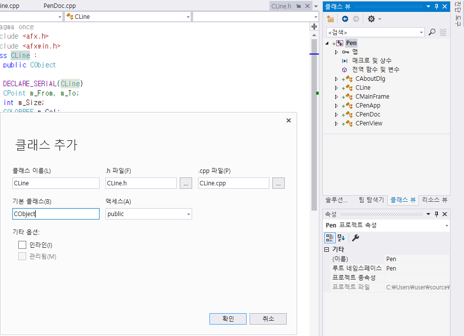
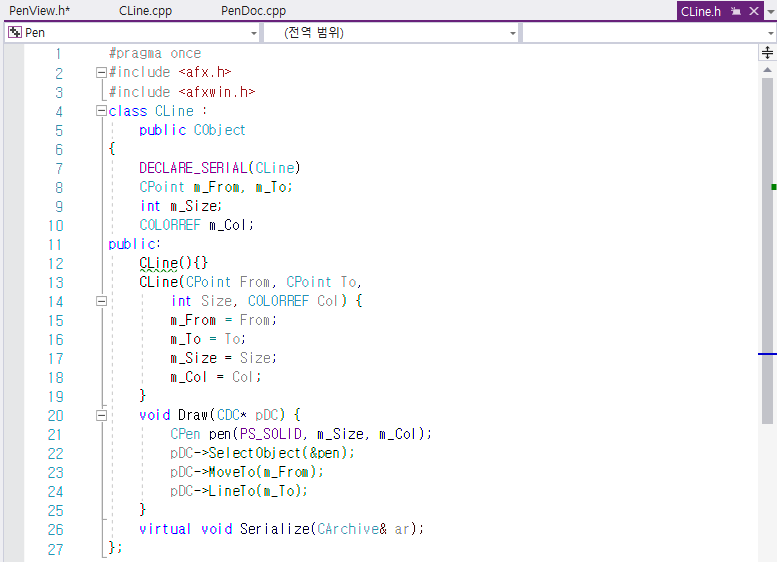
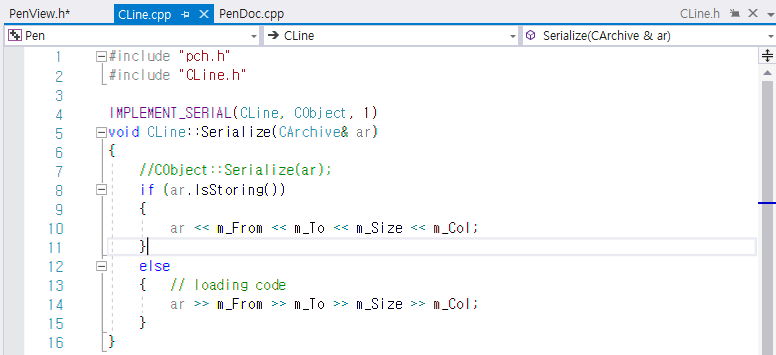
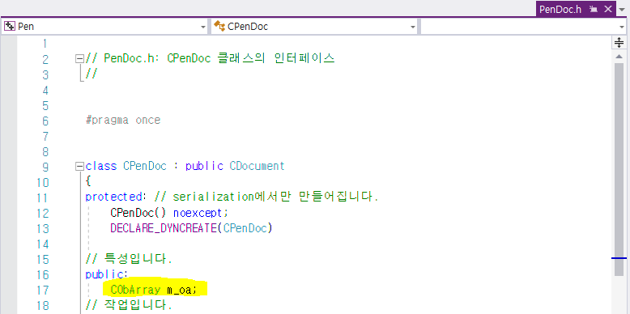
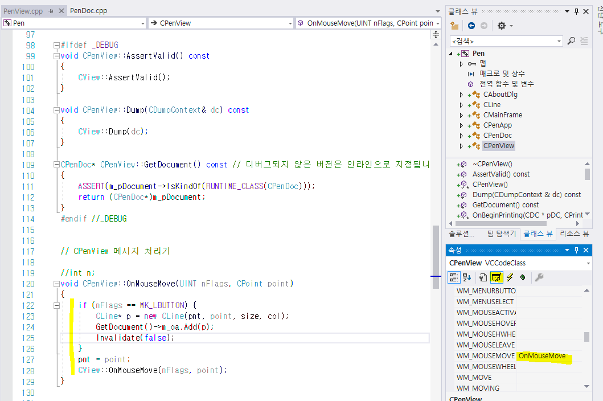
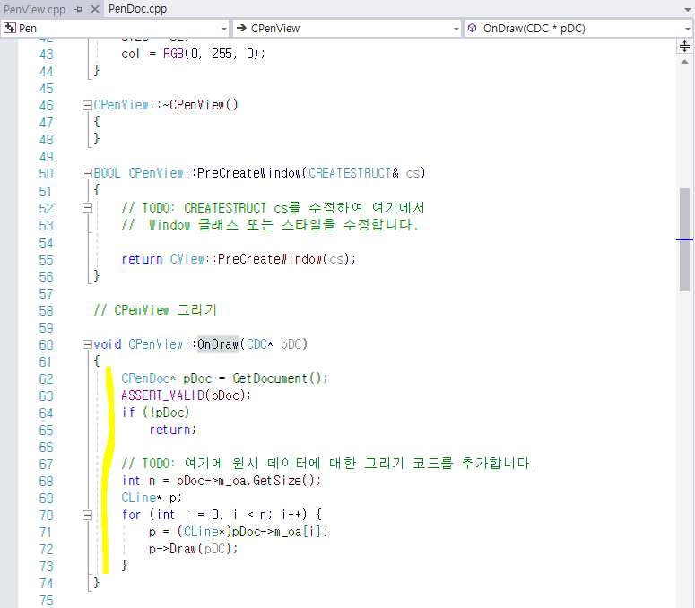
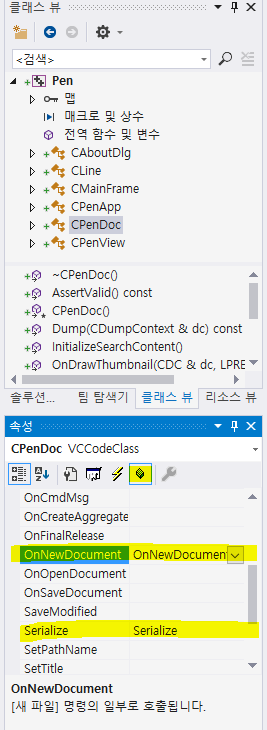
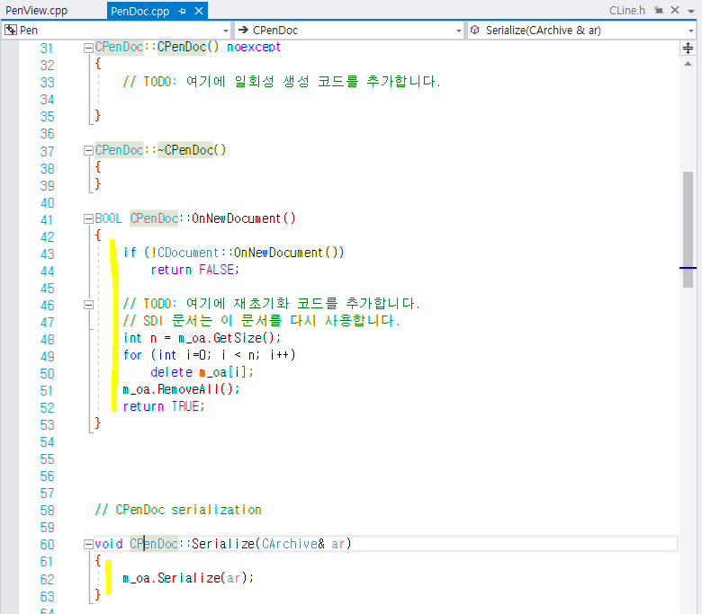

# SDIPen

1. CLine 클래스 추가

2. CLine.h에 아래와 같이 코드 작성

3. CLine.cpp에 아래와 같이 코드 추가

4. PenDoc.h의 public 에 아래와 같이 코드 추가

5. 속성의 메시지를 통해 WM_MOUSEMOVE 추가

6. PenView.cpp의 OnDraw에 아래와 같이 코드 추가

7. 클래스 뷰에서 CPenDoc을 선택 후 OnNewDocument와 Serialize 추가  

8. PenDoc.cpp에서 아래와 같이 코드 추가 후 Ctrl+F5

